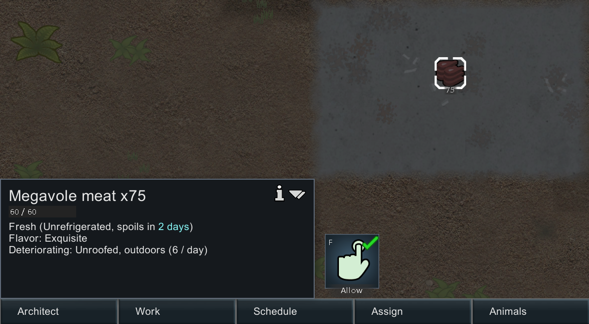
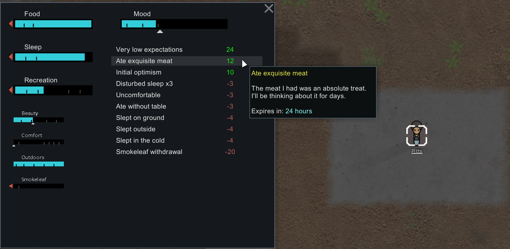

# Unique Meat Flavors

> Every animal species in RimWorld gets a randomized flavor each new save. Cooking and eating that meat now means a little more — for better or worse.



## What it does

At the start of every new game, the mod assigns one of five flavor tiers to each meat type the world knows about — vanilla, DLC, and modded animals alike:

| Tier         | Mood when eaten |
|--------------|-----------------|
| **Bland**    | -3              |
| **Common**   | (silent)        |
| **Tasty**    | +2              |
| **Delicious**| +4              |
| **Exquisite**| +6              |

When a colonist eats that meat — raw, butchered, or as part of a meal — they gain an **extra** mood thought based on the species' flavor. It stacks alongside the vanilla food thoughts (`Ate fine meal`, etc.), it doesn't replace them. *Common* is deliberately silent so unremarkable meat doesn't clutter the mood breakdown.

The distribution is bell-shaped and centered on **Common**, with the extremes rare. Assignments live with the save: a Thrumbo that's exquisite in one playthrough might be bland in the next.



## Features

- **Per-save randomization** — fresh roll every new world.
- **Inspect string** on meat stacks shows the flavor.
- **Modded animals are first-class** — any `meatDef` the game knows about gets a flavor automatically.
- **Mid-campaign safe** — add an animal mod after starting a save and its meats get assigned flavors on the next load.
- **Meals with mixed meat** average flavor across their meat ingredients (non-meat ingredients are ignored).
- **Bilingual: English / Spanish.**
- **Multiplayer compatible** with [Zetrith's Multiplayer](https://steamcommunity.com/sharedfiles/filedetails/?id=2606448745). Settings are host-authoritative, re-rolls and toggles propagate to all clients.

## Install

### Steam Workshop (recommended)
<!-- TODO: replace with Workshop link once published -->
*Workshop link coming once published.*

### Manual
1. Download the latest release from the [Releases page](https://github.com/Joaprzp/unique-meat-flavors/releases).
2. Extract into your RimWorld `Mods/` folder.
3. Enable **Unique Meat Flavors** in the in-game mod manager. Make sure [Harmony](https://steamcommunity.com/sharedfiles/filedetails/?id=2009463077) is loaded above it. (Required dependency.)

## Settings

`Options → Mod settings → Unique Meat Flavors`.

- **Enable mood effects** — when off, flavors still randomize and show on inspect strings, but eating doesn't generate mood thoughts. Cosmetic-only mode. Default: on.
- **Mood magnitude multiplier** — `0.5×` (subtle) / `1×` (default) / `2×` (intense). Applies forward to newly-gained thoughts; existing memories keep whatever multiplier was active when they were gained.
- **Re-roll all flavors** — reassigns every meat flavor in the current save. Confirmation gated.

With no save loaded the menu edits defaults for new games. With a save loaded it edits that save's per-game values (which the host owns in multiplayer).

## Compatibility

- **RimWorld 1.6.** Built and tested against the current 1.6 builds.
- **All vanilla DLCs**: Royalty, Ideology, Biotech, Anomaly, Odyssey.
- **Animal mods**: Vanilla Animals Expanded, Alpha Animals, Megafauna, and any other mod that follows the standard `meatDef` pattern. Species that share a `meatDef` in vanilla (wolves, bears, poultry, insectoids, etc.) share a flavor — that's by design, since the player can't distinguish their meat in the inventory anyway.
- **[Zetrith's Multiplayer](https://steamcommunity.com/sharedfiles/filedetails/?id=2606448745)**: fully synced. The mod ships the MultiplayerAPI stubs so single-player players don't need MP installed.
- **Save-game safe**: adding the mod mid-campaign assigns flavors at next load. Removing it later — flavor thoughts already on colonists expire naturally and the per-save dictionary is silently dropped.

## Languages

- English
- Spanish (Rioplatense)

To add another: copy `Languages/English/Keyed/UniqueMeatFlavors.xml` and `Languages/Spanish/DefInjected/ThoughtDef/Thoughts_FlavorMeat.xml` to your locale folder and translate the values. PRs welcome.

## FAQ

**Why are two different species sharing a flavor?**
RimWorld groups some species under a shared `meatDef` (wolves, bears, poultry, insectoids…). The mod assigns flavor per `meatDef` because that's the unit the player sees in their inventory — meat from a Timber Wolf and an Arctic Wolf are the same item.

**Why doesn't human meat have a flavor?**
Cannibalism mood is already covered by vanilla. Adding a flavor on top would either double-dip or clash with traits like Cannibal.

**Why don't I see a flavor thought after eating?**
Three likely causes: the meat rolled `Common` (silent by design), the *Enable mood effects* toggle is off, or the colonist isn't a humanlike (animals don't get mood).

**Can I bias the distribution toward better flavors?**
Not currently. Open an issue if there's interest.

**Does the multiplier affect existing thoughts retroactively?**
No — it's forward-only. A thought gained at `0.5×` stays at `0.5×` even if you raise the multiplier later. This avoids desyncs in multiplayer and matches the toggle's "forward-only" semantics.

## Future ideas

Out of scope for the initial release, tracked here so they don't get accidentally promised:

- Effects on meat market value.
- Recipes requiring a minimum flavor tier.
- A "Gourmet" trait that amplifies flavor mood.
- Visitor / trader reactions to flavor.
- Hidden flavors discovered by tasting.
- Per-flavor textures or icons.
- Sound effects on standout meat.

If one of these jumps out as something you'd actually use, file an issue.

## Building from source

Requires the .NET SDK (6.0 or newer). Everything else comes from NuGet — no need to install the .NET Framework 4.7.2 developer pack or copy DLLs out of your RimWorld install.

```
dotnet build Source/UniqueMeatFlavors.csproj -c Release
```

The build drops `UniqueMeatFlavors.dll` straight into `Assemblies/`. Symlinking the repo into RimWorld's `Mods/` folder lets you rebuild and reload without copying:

```
mklink /J "G:\SteamLibrary\steamapps\common\RimWorld\Mods\UniqueMeatFlavors" "C:\path\to\unique-meat-flavors"
```

(`mklink /J` runs without admin in normal `cmd`. In PowerShell use `New-Item -ItemType Junction`.)

## Contributing

- **Bug reports**: [open an issue](https://github.com/Joaprzp/unique-meat-flavors/issues). Include your `Player.log` and a mod list — both are usually enough to triage.
- **Translations**: open a PR with the new locale folder. Mirror the structure under `Languages/English/` and `Languages/Spanish/`.
- **Code changes**: PRs welcome for bugs. For features, open an issue first to talk scope — the *Future ideas* section is the agreed-on no-go list.

## License & credits

[MIT](LICENSE).

- Built on [Harmony](https://github.com/pardeike/Harmony) by Andreas Pardeike.
- Multiplayer compat via [MultiplayerAPI](https://github.com/rwmt/MultiplayerAPI) (rwmt).
- RimWorld is by [Ludeon Studios](https://ludeon.com).
